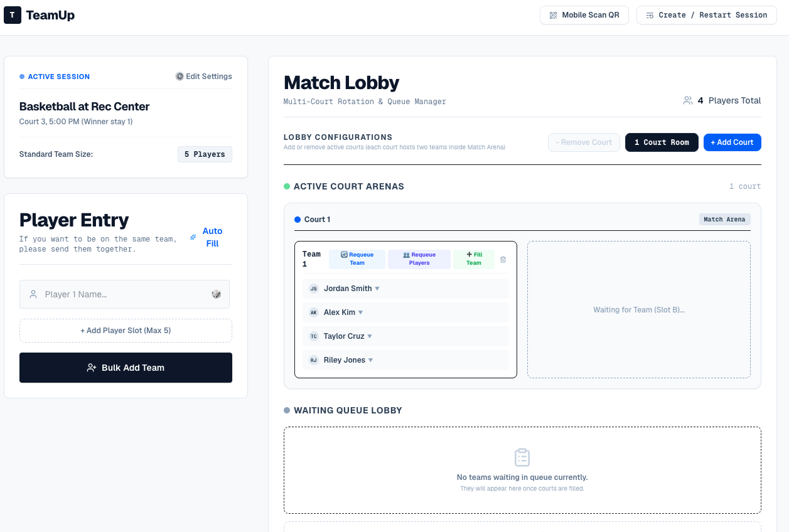

# TeamUp: Rec Center Basketball Queue

## 🏀 The Why
Tired of the chaos and arguments over "who's got next" at the Rec Center? I built TeamUp to completely eliminate the confusion. It's a fun, transparent, and fair way to easily queue plays, organize squads, and definitively keep track of who is running the court! No more forgetting whose turn it is.

## 🚀 How to Use
**Access the live app here:** 👉 [https://weil11.github.io/TeamUp/](https://weil11.github.io/TeamUp/)

⚠️ **Important Note:** This application runs entirely in your browser. All of your queue data, teams, and match history are saved directly to your device. **Do not close the browser tab or clear your browser history** during your session, or you will lose the queue! (Refreshing the page is perfectly fine and will remember your data).

## ⚙️ The System
TeamUp is a fast, responsive Single Page Application (SPA) built with **React**, **Vite**, and **TailwindCSS**. 

- **Smart Queuing:** Players can join individually or as a pre-formed squad. The app automatically groups individuals into standard-sized teams.
- **Dynamic Courts:** Need more space? Easily increase or decrease the number of active courts. The system automatically pulls waiting teams "On Deck" and onto the active courts when a game ends.
- **Match History & Stats:** Records every completed game to compute an automatic leaderboard, tracking individual player win rates and total matches played.
- **Architecture:** Hosted 100% statically on GitHub Pages. Data persistence is handled purely via browser `localStorage` to keep the app lightning fast and free to host.

## 🧠 Interesting Technical Challenges

**The Queue & Squad Integrity Algorithm**
One of the most complex problems to solve was maintaining fairness in the queue while respecting "Squad Integrity" (groups of friends who want to play together). 

Our custom queuing algorithm handles this via several key mechanisms:
1. **Dynamic Re-packing**: When the global team size changes (e.g., switching from 3v3 to 5v5), the algorithm flattens all waiting players into a single linear queue and synchronously chunks them into new standard-sized teams without losing anyone's chronological position.
2. **Block-Pulling & Integrity**: When filling an active team with waiting players, the algorithm scans the queue and groups players by their `squadCode`. It treats squads as unbreakable "blocks" to ensure friends aren't split up across different teams, intelligently calculating remaining slots.
3. **Active Court Shifting**: If a team on an active court is disbanded, the algorithm instantly identifies the gap, pulls the first waiting team past the "Active Threshold" onto the court, and then individually redistributes the disbanded players into the optimal available slots at the back of the queue.

## 🏗️ How to Build This in 2 Hours
This project is an experiment in rapid prototyping using modern AI-assisted development tools:
1. **UI Design:** Used **Stitch** to craft the initial dynamic, glassmorphic user interface.
2. **Frontend Testing:** Leveraged **Google AI Studio** to rapidly test, iterate, and refine the React component logic.
3. **Backend & DevOps:** Utilized **Claude** and **Gemini** to structure the project, manage state persistence, and fully automate the GitHub Actions CI/CD deployment pipeline.
